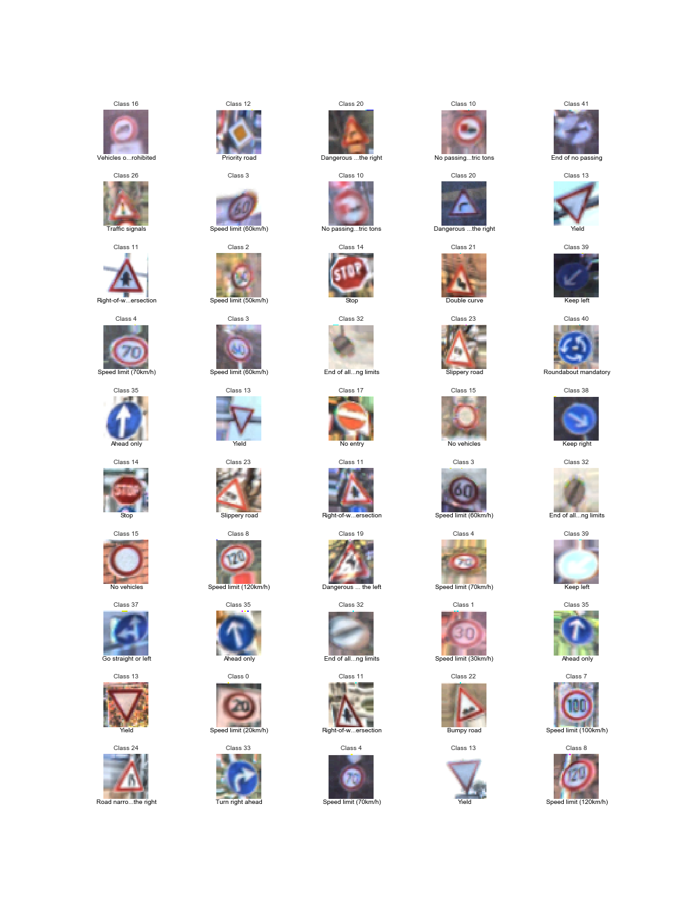
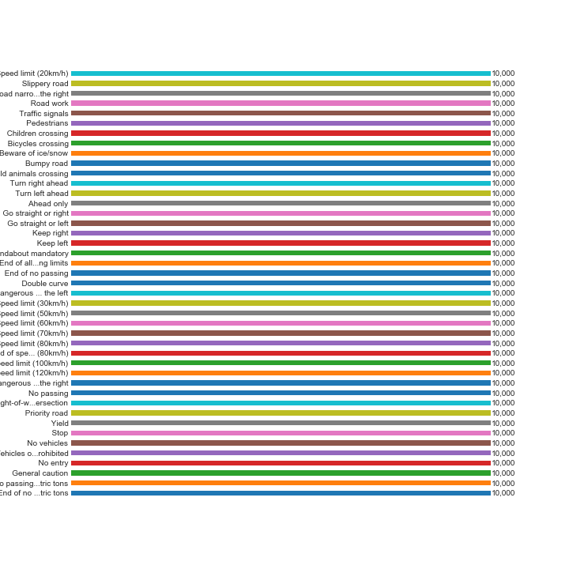
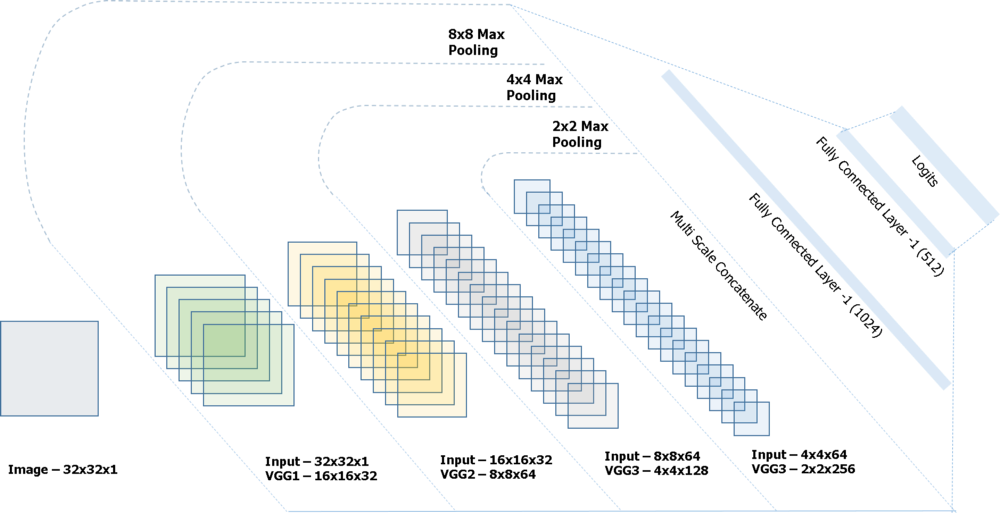
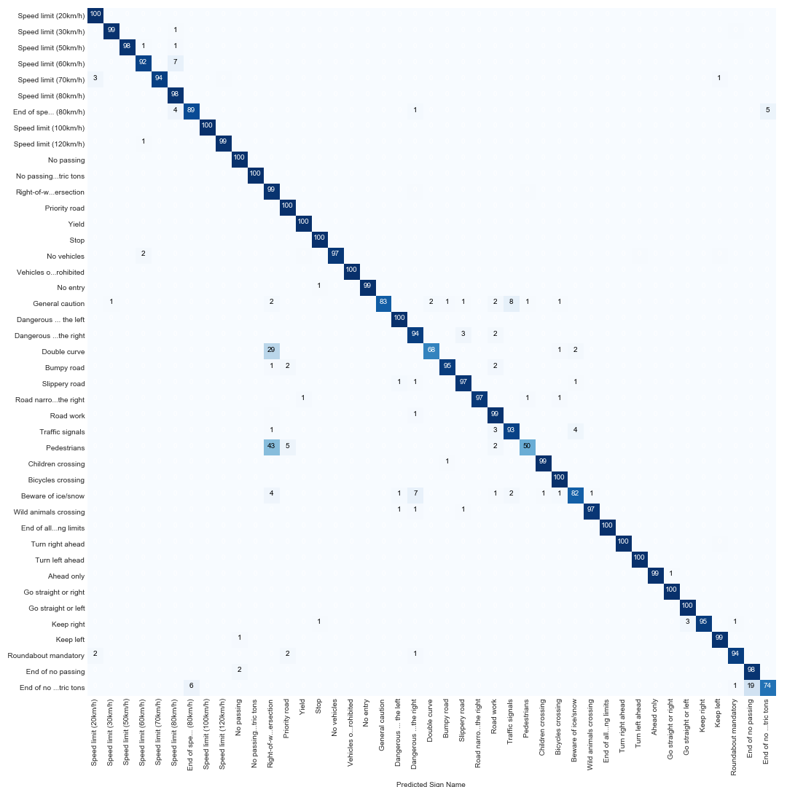
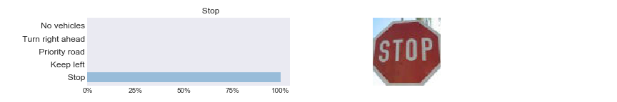
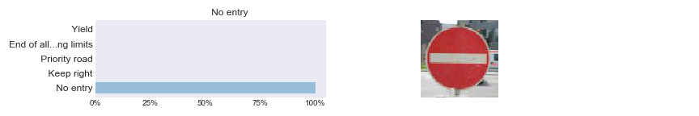
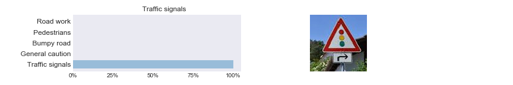
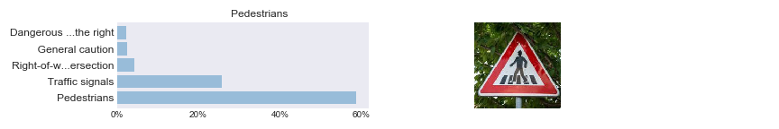
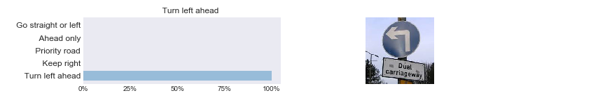
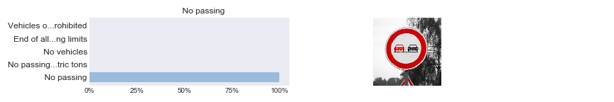

Project 2, Term 1: Traffic sign Classification
=================================================

Final Result
--------------

Files Submitted
--------------

#### Have all project files been included with the submission?

This git repository contains:
-   A Jupyter notebook with code
-   HTML output of the code
-   A writeup report (markdown)

Dataset Exploration
---------------------

#### Dataset Summary

Basic Summary of the dataset:

- Number of training examples = 34,799
- Number of testing examples = 12,630
- Number of validation examples = 4,410
- Image data shape =  (32, 32, 3)
- Number of classes =  43

#### Exploratory Visualization

Training Sample Histogram:

#### Augmented Training Data
The sample data was increased to 322,500 images using rotation, translation, shearing, warping and flipping:

Random Augmented Training Samples:

Augmented Training Sample Histogram:

Design and Test a Model Architecture
---------------------

#### Preprocessing

Preprocessing techniques:
- Grayscaling (Sermanet and Lecun demonstrated that grayscale images provide higher accuracy when processed through CNN’s in their paper "Traffic Sign Recognition with Multi-Scale Convolutional Networks")
- Contrast Limited Adaptive Histogram Equalization and Histogram Equalization (for local and global visual equalization)
- Data Normalization (setting all data to values between -1 and 1)
- Re-dimensioning of data from 32x32x3 to 32x32x1 (only 1 channel dimension is required for grayscaled images)

Random Preprocessed Training Samples

#### Model Architecture

The Model Architecture is adapted from the Oxford Visual Geometry Group (VGG). A few changes were made to the model.  First, the size of the input layer was reduced from 224x224x3 to 32x32x1.  Then, successive layers were reduced accordingly, which meant fewer layers were needed than Simonyan and Zisserman used when describing VGG in their 2014 paper, "Very Deep Convolutional Networks for Large Scale Image Recognition."

VGG Architecture

#### Model Training

The Training Model is based on the Traffic_Sign_Classifier Jupyter Notebook with a few modifications.   Most significantly, the Training Model includes a “patience” feature that stops training after 5 EPOCHS with no improvement in validation accuracy.  The model also has an exponentially decaying learning rate that is set initially to .0005, then reduced by 95% after every EPOCH.  The BATCH_SIZE is set to 256.

Training Results:

| EPOCH | Validation Accuracy |
| :---: | :---: |
| 1 | 76.51% |
| 2 | 96.71% |
| 3 | 98.48% |
| 4 | 99.00% |
| 5 | 99.16% |
| 6 | 99.34% |
| 7 | 99.46% |
| 8 | 99.32% |
| 9 | 99.39% |
| 10 | 99.55% |
| 11 | 99.61% |
| 12 | 99.27% |
| 13 | 99.46% |
| 14 | 99.39% |
| 15 | 99.64% |

#### Solution Approach

The VGG model architecture was created using a construct that easily abstracts CNN's into a set of simple, consistent statements.  All dropout statements were eliminated from the convolutional layers, primarily because Haibing Wu and Xiaodong Gu determined in their paper "Toward Dropout Training for Convolutional Neural Networks" that it’s best to use max pooling to reduce the sample size of convolutional layers and dropout to reduce the sample size of fully connected layers.  Max pooling (2x2) was used whenever pooling was required and dropouts were set to 50% during training (dropouts were set to 0% during testing).

#### Error Analysis

- Test Data Accuracy: 97.933%
- Top-3 test accuracy: 99.311%

Confusion Matrix:

Test a Model on New Images
---------------------

#### Acquiring New Images

The images below were acquired from the internet. All but two images were correctly classified with probabilities greater than 95%.  The two that were difficult for the model to classify were Pedestians and Beware of ice/show.  With a percentage match of 62, Pedestrians had the lowest test data accuracy in the Confusion Matrix.  The Beware of ice/snow sign was selected because it was partially covered with snow.  In both cases, the model correctly predicted the sign; however the probability scores were less than 60%.

New Images:

#### Performance on Test Images

| Image | Actual | Predicted |
| :---: | --- | --- |
| 1 |   Speed limit (30km/h) |    Speed limit (30km/h) |
| 2 | Right-of-w...ersection |  Right-of-w...ersection |
| 3 |          Priority road |           Priority road |
| 4 |                   Stop |                    Stop |
| 5 |               No entry |                No entry |
| 6 |           Double curve |            Double curve |
| 7 |        Traffic signals |         Traffic signals |
| 8 |            Pedestrians |             Pedestrians |
| 9 |      Children crossing |       Children crossing |
| 10 |     Beware of ice/snow |      Beware of ice/snow |
| 11 |        Turn left ahead |         Turn left ahead |
| 12 |             Keep right |              Keep right |
| 13 |   Roundabout mandatory |    Roundabout mandatory |
| 14 |   Speed limit (80km/h) |    Speed limit (80km/h) |
| 15 |             No passing |              No passing |

Accuracy for these 8 images is 100.0%

#### Model Certainty - Softmax Probabilities

